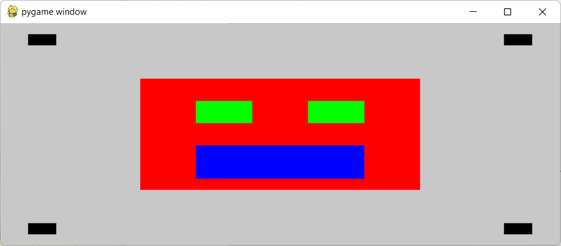

# pygame-gridcalculator
A tool that creates a custom-sized virtual grid for helping place objects 
on the screen.

## Purpose
This tool is designed to easily map positions on a pygame display without
relying on fixed pixel values.  This is done by mapping the window to a
grid, and allowing for the providing of grid co-ordinates to get the actual
pixel value on the screen.

This is designed for people getting started with pygame, or people wanting
to create uniform menu elements that scale with the display size.

## How it works
To utilise this tool, you should initialise it to a variable and pass in the
current screen size and the size of the grid you wish to use.

Once the grid has been created, you use the GridCalculator to provide
co-ordinates to the position on the screen you want to 

## Methods
This tool has the following methods:
* __size__ = _Returns the total number of points in the grid (width, height)._
* __max_points__ = _Returns the max points of the grid (width, height)._
* __top_point(point)__ = _Returns the pixel value for the point selected from
    the top of the grid._
* __left_point(point)__ = Returns the pixel value for the point selected from
    the left of the grid._
* __position((left_point, top_point))__ = _Returns the pixel values for the point
    co-ordinates selected from the grid (left, top)._
* __height_gap(top_point1, top_point2)__ = _Returns the pixel height between the
    two top grid points specified._
* __width_gap(left_point1, left_point2)__ = _Returns the pixel width between the
    two left grid points specified._
* __square(left_start, top_start, left_end, top_end)__ = _Returns the pixel height
    and width of a square based on the grid position of the top left corner
    and the bottom right corner (width, height)._
* __points_from_left(points)__ = _Returns the pixel value for the amount of grid
    points away from the left border._
* __points_from_top(points)__ = _Returns the pixel value for the amount of grid
    points away from the top border._
* __points_from_right(points)__ = _Returns the pixel value for the amount of grid
    points away from the right border._
* __points_from_bottom(points)__ = _Returns the pixel value for the amount of grid
    points away from the bottom border._

## Example
### Basic usage
Setting the variable and creating a new rect using a grid:

    display = pygame.display.set_mode((200, 100), pygame.RESIZABLE)
    display.fill((255, 255, 255))
    grid = GridCalculator(display.get_width(), display.get_height(), 10, 5)
    
    rect = pygame.Rect(grid.left_point(1), grid.left_point(1),
                       grid.width_gap(1, 3), grid.height_gap(1, 3))
    pygame.draw.rect(display, (255, 0, 0), rect)

So in this example, a pygame display is created of 200x100, and a grid
is created splitting this into a 10x5 grid, like so:

This creates a square on the screen like so:

### Full Scalable Example
The following creates an initial display with a rect and a grid that
can scale with the display.

    def example():
        running = True
        display = pygame.display.set_mode((300, 300), pygame.RESIZABLE)
        display_height, display_width = display.get_height(), display.get_width()
        grid = Grid(display_width, display_height, 20, 20)
    
        pygame.init()
    
        while running:
            display.fill((200, 200, 200))
    
            for event in pygame.event.get():
                if event.type == pygame.QUIT:
                    running = False
                    break
                if event.type == pygame.VIDEORESIZE:
                    display_height = event.h
                    display_width = event.w
                    grid = Grid(display_width, display_height, 20, 20)
    
            # Draw face
            pygame.draw.rect(display, (255, 0, 0),
                             pygame.Rect(grid.left_point(5), grid.top_point(5),
                             grid.width_gap(5, 15), grid.height_gap(5, 15)))
            pygame.draw.rect(display, (0, 0, 255),
                             pygame.Rect(grid.left_point(7), grid.top_point(11),
                             grid.width_gap(7, 13), grid.height_gap(11, 14)))
            pygame.draw.rect(display, (0, 255, 0),
                             pygame.Rect(grid.left_point(7), grid.top_point(7),
                             grid.width_gap(7, 9), grid.height_gap(7, 9)))
            pygame.draw.rect(display, (0, 255, 0),
                             pygame.Rect(grid.left_point(7), grid.top_point(7),
                             grid.width_gap(7, 9), grid.height_gap(7, 9)))
            pygame.draw.rect(display, (0, 255, 0),
                             pygame.Rect(grid.left_point(11), grid.top_point(7),
                             grid.width_gap(11, 13), grid.height_gap(7, 9)))
    
            # Draw corner squares
            sq_width, sq_height = grid.width_gap(1, 2), grid.height_gap(1, 2)
    
            pygame.draw.rect(display, (0, 0, 0),
                             pygame.Rect(grid.points_from_left(1),
                                         grid.points_from_top(1),
                                         sq_width, sq_height))
            pygame.draw.rect(display, (0, 0, 0),
                             pygame.Rect(grid.points_from_right(2),
                                         grid.points_from_top(1),
                                         sq_width, sq_height))
            pygame.draw.rect(display, (0, 0, 0),
                             pygame.Rect(grid.points_from_left(1),
                                         grid.points_from_bottom(2),
                                         sq_width, sq_height))
            pygame.draw.rect(display, (0, 0, 0),
                             pygame.Rect(grid.points_from_right(2),
                                         grid.points_from_bottom(2),
                                         sq_width, sq_height))
            pygame.display.update()

This splits the screen into a 20x20 grid, and is able to rescale dependent
on the size of the window.  If the size is changed, the rectangles will
scale based on the new size of the window, still in a 20x20 grid.

When the window initially loads, the shapes display like so:

If the window is resized, the shapes adjust with the size of the grid:

Dependent on the situation, you may want to modify the grid based on 
the window size and rescale the grid appropriately.  Because the grid is
repopulated on the resize an if statement could be added if needed to
check the screen width/height and modify the grid as needed.

